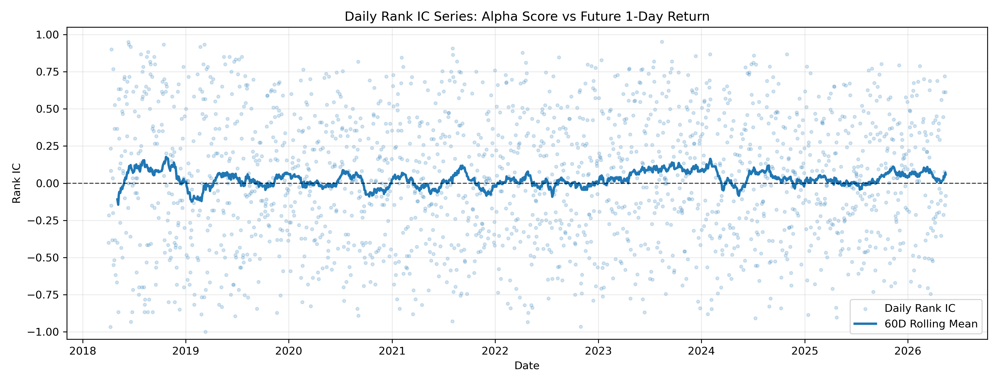
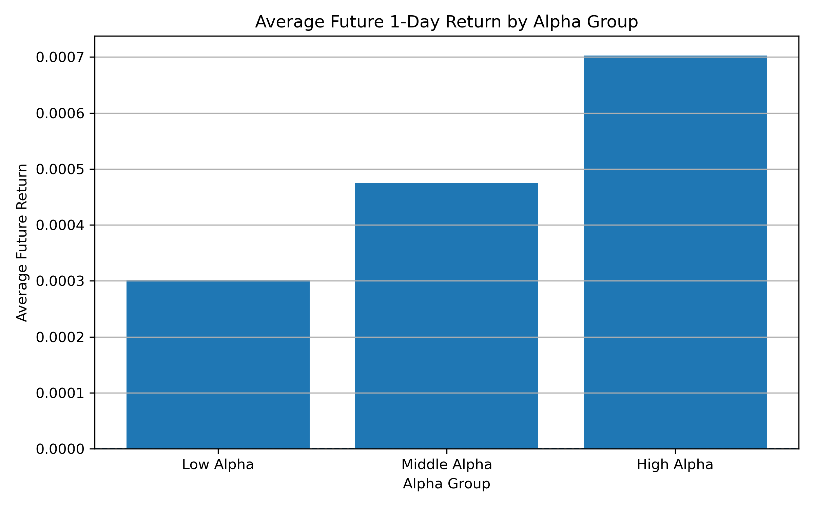
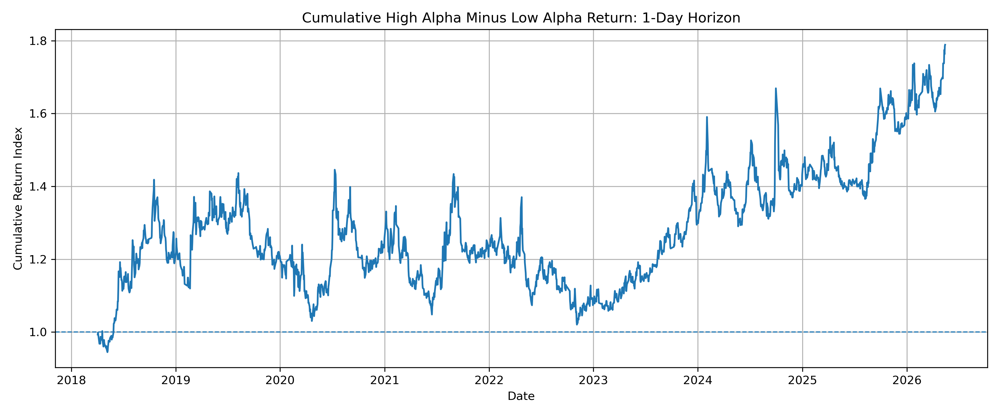
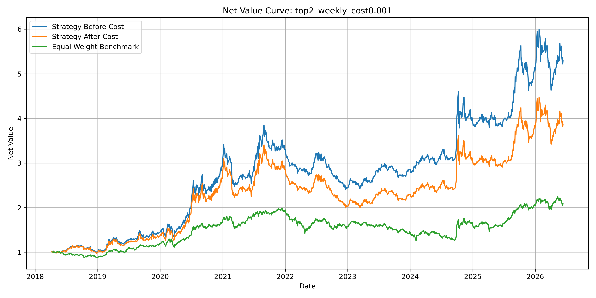
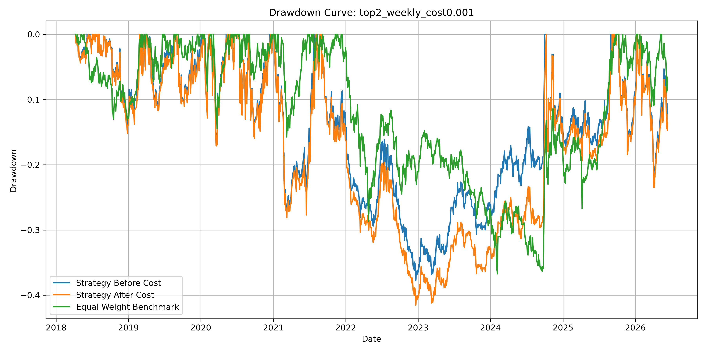
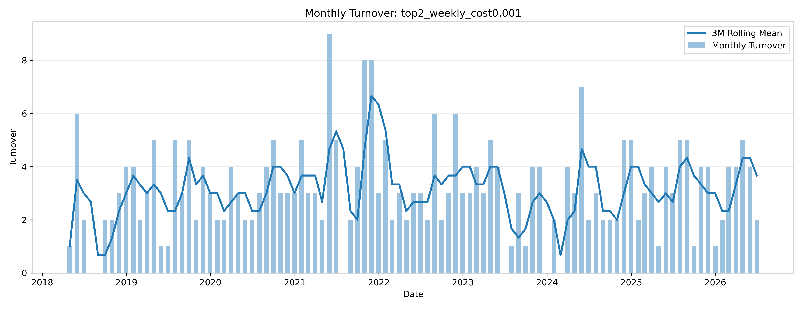

# 日频 ETF 横截面 Alpha 策略与交易成本分析
## 摘要
研究对象：A 股 ETF 池\
方法：动量、波动率、回撤、成交额变化因子 \
检验：IC、Rank IC、分组收益、OLS 回归、回测\
重点：交易成本和调仓频率\
结论：Alpha 有弱预测能力，但交易成本和换手率会显著影响可交易性
## 数据
数据来源：AKShare / 东方财富接口\
频率：日频\
资产池：宽基、行业、主题、商品、海外 ETF\
字段：open, high, low, close, volume, amount\
样本区间：2018/6/11——2026/6/11
## 因子构建
mom_20：过去 20 日收益率\
mom_60：过去 60 日收益率\
vol_20：过去 20 日年化波动率\
drawdown_20：过去 20 日回撤\
amount_change_20：成交额相对过去 20 日均值变化\
说明：\
所有因子按 date 做横截面 z-score 标准化；\
alpha_score 是多个标准化因子的线性组合；\
future_return 只用于检验，不参与因子构造，避免未来函数。
## 因子分析
### IC / Rank IC


### 分组收益

### High Alpha - Low Alpha


### 结论：
该 Alpha 因子具有弱但方向一致的横截面预测能力。
## 回测框架
每日生成 Alpha 信号\
根据调仓频率每日 / 每周 / 每月调仓\
Top 1 / Top 2 / Top 3 等权持有\
权重滞后一日生效，避免未来函数\
交易成本通过 turnover × cost_rate 扣除\
基准为 ETF 池等权组合\
在 t 日收盘后观察 Alpha 信号，实际持仓从 t+1 日开始生效。
## 回测结果




### 主策略选择

本文选择 `top2_weekly_cost0.001` 作为主策略，即：

```text
每周调仓 + 持有 Alpha 得分最高的前 2 只 ETF + 单边交易成本 0.1%
```

选择该策略的原因是：相较每日调仓，该策略能够有效降低换手率和交易成本；相较每月调仓，该策略又能更及时地反映 Alpha 排名变化。同时，Top 2 持仓在保留 Alpha 暴露的同时，相比 Top 1 具有一定分散化效果。

### 主策略绩效表现

| 指标           | 主策略：Top 2 Weekly，成本 0.1% | ETF 等权基准 |
| ------------ | -----------------------: | -------: |
| 总收益率         |                  286.91% |  109.86% |
| 年化收益率        |                   18.74% |    9.87% |
| 年化波动率        |                   26.70% |        - |
| Sharpe Ratio |                    0.702 |    0.539 |
| 最大回撤         |                  -41.53% |  -36.72% |
| Calmar Ratio |                    0.451 |        - |
| 胜率           |                   51.03% |        - |
| 平均日换手率       |                   15.77% |        - |
| 年化换手率        |                    39.74 |        - |
| 总换手率         |                   313.00 |        - |

从结果看，主策略在扣除 0.1% 单边交易成本后，年化收益率为 **18.74%**，高于 ETF 等权基准的 **9.87%**；Sharpe Ratio 为 **0.702**，高于基准的 **0.539**。这说明该 Alpha 策略在样本区间内具有一定风险调整后收益优势。

但该策略的最大回撤为 **-41.53%**，大于基准的 **-36.72%**，说明策略虽然提高了收益和 Sharpe Ratio，但并没有降低尾部下行风险。与此同时，策略年化换手率达到 **39.74**，表明交易成本对策略表现具有重要影响。

因此，主策略的回测结果可以支持该 Alpha 信号具有一定可交易研究价值，但不能直接证明其已经具备稳定实盘盈利能力。后续需要进一步引入波动率控制、止损机制、样本外检验和更严格的交易成本建模。


### 结论：
如果扣费后策略优于基准：\
策略在扣除交易成本后仍取得一定超额风险调整收益，但表现对调仓频率和交易成本敏感。  
\
如果扣费后策略不如基准：\
策略在扣费前具有一定表现，但高换手率和交易成本显著侵蚀收益，说明该 Alpha 更适合作为组合信号的一部分，而非单独交易信号。
## 回归分析
### 说明：
OLS 回归用于辅助检验 Alpha 因子与未来收益之间的统计关系。  
> [!Note] Model
>$$future\;return = β_0 + β _1 z_{mom_{20}} + β_2 z_{mom_{60}} + β3 z_{vol_{20}} + β4 z_{drawdown_{20}} + β5 z_{amount\;change_{20}} + ε$$
## 局限
ETF 横截面数量有限，因子检验样本不如全 A 股选股丰富；  
未考虑真实买卖价差、冲击成本和成交约束；  
参数设定存在一定主观性；  
样本外检验仍然不足；  
Alpha 信号较弱，不能独立证明稳定盈利能力；  
部分未来收益窗口存在重叠样本问题。
## 结论
本项目构建了一个基于日频 ETF 横截面数据的 Alpha 策略研究框架。实证结果显示，综合 Alpha 得分与未来 ETF 收益存在弱但方向一致的正相关关系，IC、Rank IC 和分组收益检验均显示一定排序能力。回测部分进一步表明，策略表现受到调仓频率、持仓数量和交易成本的显著影响。整体来看，该 Alpha 更适合作为横截面排序和组合构建的基础信号，而不应被解释为稳定的单一交易策略。